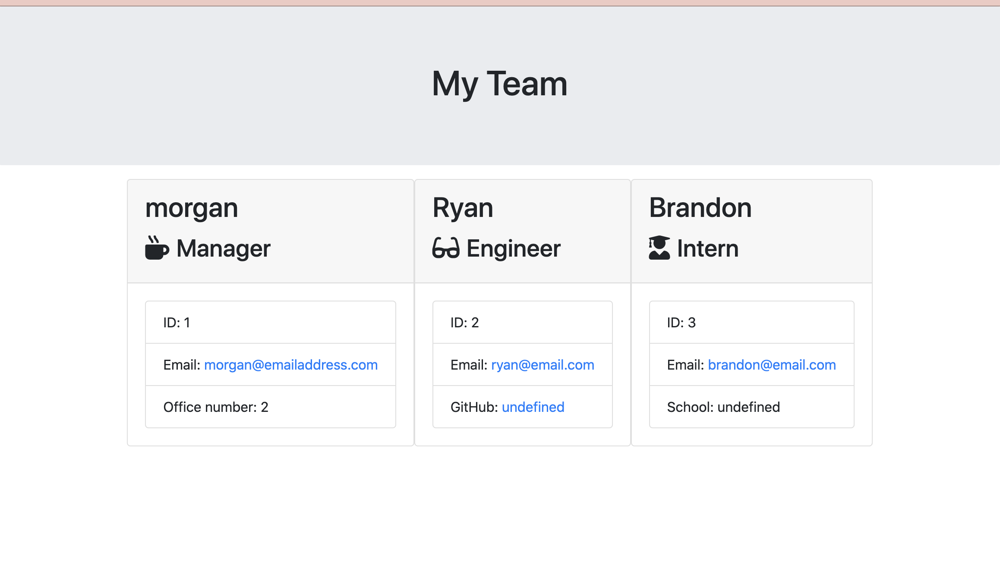

# template-engine 
## Description: 
Enter details about an employee such as name, and email address in the command line. Then an HTML page will be generated with all of the employees you added. 
## Usage: 
You will need to npm install in the command line in order for the prompts to appear.  

DEPLOYED URL: https://rachelsakles.github.io/template-engine/

  

